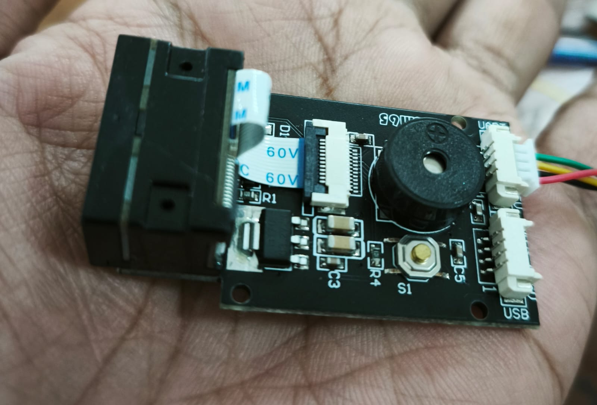
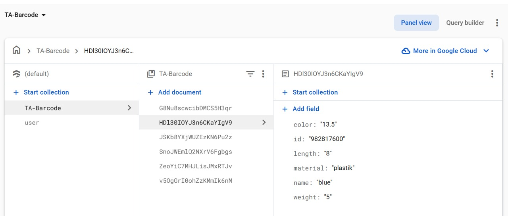

# My Mini Project
# 📦 ESP32 Barcode Scanner with GM65 + Firebase


A lightweight barcode scanner system using **ESP32-WROOM-32 DevKit V1** and **GM65 module**, sending scanned data to **Firebase Firestore** via WiFi. No external server required, perfect for cloud-based inventory systems.

---

## 🔌 Hardware Requirements

- ESP32-WROOM-32 DevKit V1 
- GM65 Barcode Scanner (UART)
- USB to TTL Programmer
- Jumper Wires
- Firebase Account (Firestore enabled)

---

## 🧰 Wiring Diagram

| GM65 Pin | ESP32-WROOM-32 DevKit V1 |
|----------|--------------------------|
| TX       | RX0                      |
| RX       | TX0                      |
| VCC      | 5V                       |
| GND      | GND                      |

> ⚠️ Disconnect TXD during firmware upload to avoid interference with serial communication.

---

## 🌐 Firebase Setup

1. Create a project on [Firebase Console](https://console.firebase.google.com/)
2. Enable **Firestore Database**
3. Obtain:
   - `databaseURL` → format: `project-id.firebaseio.com`
   - `database secret` → from Service Accounts tab (legacy auth)
4. Create a collection named `scanned_barcodes`

---

## 🧾 `secrets.h`

Create a new file `secrets.h` in your Arduino project folder:

```cpp
#define WIFI_SSID "YOUR_WIFI_NAME"
#define WIFI_PASSWORD "YOUR_WIFI_PASSWORD"

#define FIREBASE_HOST "your-project-id.firebaseio.com"
#define FIREBASE_AUTH "YOUR_FIREBASE_SECRET_OR_TOKEN"
```

---


## 🧪 Expected Output

### 🔎 Serial Monitor


### 🔥 Firestore Entry


---

## 📚 Reference

- GM65 Datasheet
- FirebaseESP32 library by @mobizt
- Arduino IDE with ESP32 board definitions

---

